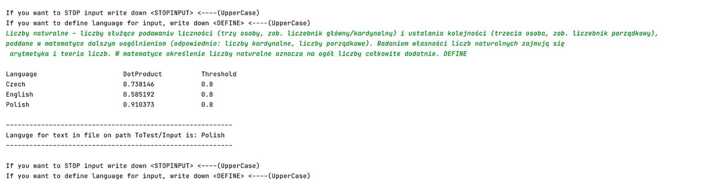

# LanguageDeterminer(Single-Layer Neural Network)

## Program arguments

1: Threshold  
2: Alpha 

## Add language
To add a language to the neural network, create a folder with the name of the language in the 'resources' folder and fill it with some texts

### Recources folder

Language        | Texts
----------------|--------
Polish          | `BarcelonaPL,  BillGatesPL,  ThomasAlvaEdisonPL`
English         | `BarcelonaEN,  BillGatesEN,  ThomasAlvaEdisonEN`
Czech           | `BarcelonaCZ,  BillGatesCZ,  ThomasAlvaEdisonCZ`

### BarcelonaPL (Text example)

`Ogłoszenie w magazynie Los Deportes z 22 października 1899 r.: Nasz przyjaciel i partner, Pan Kans Kamper z Sekcji Piłkarskiej "Sociedad Los Deportes" i były mistrz Szwajcarii, pragnąc zorganizować kilka meczów w Barcelonie, prosi, aby wszyscy, którzy lubią ten sport, skontaktowali się z nim, przyszli do biura redakcji w czwartkowe i piątkowe noce, od 9 do 11.`

## Supplements

If program executes without arguments, variables `Threshold` and `Delta` will be assigned with values `5.0` and `0.3` 

If argument for variable `Threshold` is less than `0.1`, it will be assigned with value `5.0`;

If argument for variable `Delta` is less than `0.1` or greater than `1.01`, it will be assigned with value `0.3`;

## Start

When the program starts, it goes through all the texts 10 times and tries to train the neural network.

After that, the program will try to determine the language for the text located in the path "ToTest/Text.txt".

Next, the program will wait for the user-input, for which, after entering the `<DEFINE>` keyword, the language will be determined.

To stop user-input, write down `<STOPINPUT>` keyword

After determining the language, the neural network will highlight the results of the calculations

### Output example

